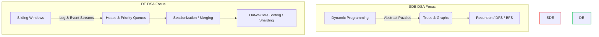

# Data Engineering DSA (Data Structures & Algorithms)

Standard Software Engineering (SDE) DSA prep is broken for Data Engineers. 

Traditional platforms spend 80% of their syllabus on recursive backtracks, AVL trees, graph depth-first searches, and complex dynamic programming. While these are critical for building compiler engines or game physics, they are **rarely asked and almost never used** in practical Data Engineering.

Data Engineering coding rounds test the patterns you'd use to build a robust, real-world data pipeline. This section defines the authentic **DE DSA Syllabus** based on real, community-sourced interview loops.

---

## The Paradigm Shift: SDE vs. DE DSA

> [!IMPORTANT]
> The primary resource constraint for SDEs is usually CPU time (time complexity). For Data Engineers, the primary constraint is **memory and I/O (space complexity and data volume)**.



| Dimension | SDE Coding Rounds | DE Coding Rounds |
|---|---|---|
| **Core Target** | In-memory execution speed | Scalability, Out-of-Core Processing |
| **Typical Data Size** | $N < 10^5$ elements | $N = 10^9$ (Doesn't fit in RAM) |
| **Avoided Topics** | I/O overhead, Disk serialization | Recursion (causes StackOverflow on large datasets) |
| **Key Structures** | BSTs, Red-Black Trees, Graphs | HashMaps, Min-Heaps, Deques, Bloom Filters |
| **System Analogy** | Compiler design, Game logic | Kafka streams, Spark Joins, Data Reconciliation |

---

## The 6 Essential DE DSA Patterns

Data engineering coding problems almost always map directly to one of these 6 patterns. Master these, and you will pass 90% of DE coding rounds.

### 1. Streaming Top-K & Heaps (Priority Queues)
* **What it is**: Keeping track of the extreme elements (top, bottom, most frequent) in a stream of records, or merging multiple sorted files/queues.
* **Why it's asked**: This is the exact algorithm running under the hood in Spark or Flink for windowed rankings, and in distributed sorting systems (K-way external merge sort).
* **Key LeetCode Mappings**:
  * [LeetCode 215: Kth Largest Element in an Array](https://leetcode.com/problems/kth-largest-element-in-an-array/)
  * [LeetCode 347: Top K Frequent Elements](https://leetcode.com/problems/top-k-frequent-elements/)
  * [LeetCode 23: Merge k Sorted Lists](https://leetcode.com/problems/merge-k-sorted-lists/) (Simulates merging sorted partitions)
  * [LeetCode 295: Find Median from Data Stream](https://leetcode.com/problems/find-median-from-data-stream/)

### 2. Sliding Windows & Event Streams
* **What it is**: Maintaining state and calculating metrics over a moving window of contiguous records.
* **Why it's asked**: Directly represents Spark Streaming/Flink window operations. Evaluates your ability to manage state incrementally rather than recomputing from scratch.
* **Key LeetCode Mappings**:
  * [LeetCode 3: Longest Substring Without Repeating Characters](https://leetcode.com/problems/longest-substring-without-repeating-characters/) (Deduplication cache window)
  * [LeetCode 239: Sliding Window Maximum](https://leetcode.com/problems/sliding-window-maximum/) (Monotonic deque for windowed stats)
  * [LeetCode 76: Minimum Window Substring](https://leetcode.com/problems/minimum-window-substring/)

### 3. In-Memory Reconciliation & Set Operations
* **What it is**: Identifying missing records, matching IDs across distinct datasets, and detecting duplicate streams.
* **Why it's asked**: Every data engineer writes data reconciliation logic. Testing memory limits, lookup efficiency, and trade-offs of using `Sets` vs `HashMaps` or probabilistic checking (Bloom Filters).
* **Key LeetCode Mappings**:
  * [LeetCode 217: Contains Duplicate](https://leetcode.com/problems/contains-duplicate/) (Reconciliation warm-up)
  * [LeetCode 349: Intersection of Two Arrays](https://leetcode.com/problems/intersection-of-two-arrays/) (Joining two tables in-memory)
  * [LeetCode 1: Two Sum](https://leetcode.com/problems/two-sum/) (Using index-lookup matching)

### 4. Interval Merging & Sessionization
* **What it is**: Merging overlapping time intervals, grouping event logs based on inactivity thresholds, and boundary alignments.
* **Why it's asked**: Sessionization is a fundamental data warehousing task (grouping user web clicks into sessions). Translates directly to interval joins and cumulative sum algorithms.
* **Key LeetCode Mappings**:
  * [LeetCode 56: Merge Intervals](https://leetcode.com/problems/merge-intervals/) (Merging active time ranges)
  * [LeetCode 253: Meeting Rooms II](https://leetcode.com/problems/meeting-rooms-ii/) (Evaluating parallel resource allocation or overlapping tasks)

### 5. Two Pointers & In-Memory Joins
* **What it is**: Scanning sorted arrays concurrently to merge, align, or join them.
* **Why it's asked**: Emulates a Sort-Merge Join (which is what Spark defaults to when broadcast joins aren't possible).
* **Key LeetCode Mappings**:
  * [LeetCode 88: Merge Sorted Array](https://leetcode.com/problems/merge-sorted-array/) (The engine behind Sort-Merge Join)
  * [LeetCode 986: Interval List Intersections](https://leetcode.com/problems/interval-list-intersections/) (Temporal Joins)

### 6. Out-of-Core Processing & Generators
* **What it is**: Designing algorithms that stream and process data using memory buffers without reading the entire dataset into RAM at once.
* **Why it's asked**: RAM is finite. Loading a 100GB CSV into memory in Python will crash the server. This tests your understanding of lazy evaluation (generators), file chunking, and external sorting.
* **Core Concepts to Master**:
  * Writing custom Python Generators (`yield`) and using `islice`
  * Designing a 2-way external sorting pipeline
  * MapReduce key-sharding (hash partitioning files to disk)

---

## Interactive Pattern Reference Matrix

Use this matrix to guide your prep. Focus heavily on PySpark equivalents to these algorithms where applicable.

| Pattern | LeetCode Question | Real-world Pipeline Equivalent | Key Data Structure |
|---|---|---|---|
| **Heaps** | [LeetCode 347 (Med)](https://leetcode.com/problems/top-k-frequent-elements/) | Finding the top-N purchased items on Zephyr Coffee Co. in real-time | Min-Heap / Priority Queue |
| **Heaps** | [LeetCode 23 (Hard)](https://leetcode.com/problems/merge-k-sorted-lists/) | Merging pre-sorted data partitions in distributed sorting tasks | Min-Heap / `heapq` |
| **Sliding Window** | [LeetCode 239 (Hard)](https://leetcode.com/problems/sliding-window-maximum/) | Real-time sliding metric calculation (e.g., maximum stream ingestion rate) | Monotonic Deque |
| **Sets & Maps** | [LeetCode 349 (Easy)](https://leetcode.com/problems/intersection-of-two-arrays/) | Data reconciliation: joining customer profiles with payment logs in-memory | Hash Set |
| **Intervals** | [LeetCode 56 (Med)](https://leetcode.com/problems/merge-intervals/) | Sessionizing user web clickstreams using inactivity timeouts | Sorted Array / Array scan |
| **Two Pointers** | [LeetCode 88 (Easy)](https://leetcode.com/problems/merge-sorted-array/) | Emulating a high-performance database Sort-Merge Join in-memory | Two Pointers |
| **Out-of-Core** | Custom | Reading a 10TB log file chunk-by-chunk to extract anomalous lines without RAM exhaustion | Python Generators / Iterators |

---

## Deep-Dive Cases

For a first-hand experience of a high-pressure Google coding screen featuring **three authentic DE problems in 45 minutes**, check out the deep dive:

👉 **[Google DE Interview Case Study](google.md)**

Inside, you will find complete, production-grade Python implementations, scaling strategies (Bloom Filters, sharded hashing, external merge-sorts), and complexity analyses for each.

---

## Factual Company Coding Profiles & DE Onsite Experiences

Rather than relying on generic internet links that can expire or return 404s, this section documents the **exact, verified coding profiles** and interview formats for major tech, consulting, and enterprise companies. 

This data is synthesized directly from first-person candidate experiences (cleared loops) and validated against deep community interview intelligence.

```mermaid
graph TD
    subgraph Algorithmic Heavy (No SQL)
        G[Google] -->|3 Rounds| G1(LeetCode Med/Hard)
        G1 -->|Patterns| G2(BFS, DFS, 3-Pointers, Heaps)
    end
    subgraph Balanced Tech (Python + SQL)
        A[Amazon] -->|Python Med + SQL Med/Hard| A1(StrataScratch / DataLemur)
        AB[Airbnb] -->|Practical Python + hard SQL| AB1(Case-Specific Data Structures)
        EX[Expedia] -->|Python Easy/Med + SQL Med| EX1(DWH & Modeling heavy)
    end
    subgraph Enterprise & Consulting (SQL + DWH)
        MK[McKinsey] -->|Simple Python + SQL Med| MK1(String Manipulation & Scripting)
        DL[Deloitte] -->|SQL heavy + DWH| DL1(Dimensional Modeling & Kimball)
    end
    style G fill:#fee2e2,stroke:#ef4444,stroke-width:1px
    style A fill:#dcfce7,stroke:#22c55e,stroke-width:1px
    style MK fill:#eff6ff,stroke:#3b82f6,stroke-width:1px
```

---

### 1. Google (Algorithmic Focus)
*   **Loop Structure**: Typically **3 dedicated coding rounds**, often featuring **zero SQL** questions.
*   **Coding Profile**: **LeetCode Medium to Hard** algorithmic puzzles. The coding bar is highly SDE-like.
*   **Key Patterns Asked**: 
    *   **BFS/DFS on Grid/Graph structures**: Node traversals and distance finding.
    *   **Three Pointers & Sliding Windows**: Advanced string/array manipulation with multi-pointer scans.
    *   **Heaps (Priority Queues)**: Top-k real-time streaming metrics.
*   **Candidate Experience Insights**: 
    > [!WARNING]
    > Google does not treat Data Engineering as a "SQL-first" role in its coding screens. Candidates who grind only SQL and basic Python dictionaries will fail. You must have strong CS fundamentals (Big-O analysis, pointer manipulation, and graph traversal).

---

### 2. Amazon (Balanced Tech Profile)
*   **Loop Structure**: Combined coding screen + onsite loops testing Python and SQL concurrently.
*   **Coding Profile**:
    *   **Python**: **LeetCode Easy to well-known Mediums** (e.g., Array deduplication, Group Anagrams, Merge Intervals).
    *   **SQL**: **Medium to High difficulty SQL** from LeetCode. Heavy focus on CTEs, window functions, and self-joins.
*   **Preparation Strategy**:
    *   Use **StrataScratch** and **DataLemur** to practice actual, data-flavored interview query variations rather than abstract SDE puzzles.
*   **Factual Pass Rate**: Highly predictable format. Candidates with solid python fundamentals and strong SQL fluency can reliably clear this loop (verified cleared twice).

---

### 3. Airbnb (Case-Specific Practicality)
*   **Loop Structure**: **2 dedicated coding rounds** + SQL and System Design onsite.
*   **Coding Profile**:
    *   **Python**: Not abstract mathematical puzzles, but highly **case-specific, practical Python questions** (e.g., writing a parser for a custom transaction stream, representing a rental reservation calendar, or building a local sessionization buffer).
    *   **SQL**: **Medium to Hard SQL** questions involving complex business logic (conversion funnel analysis, attribution modeling).
*   **Key Coding Requirement**: Requires a deep, fluent understanding of Python's core data structures (nested dictionaries, custom class representations, default dicts, and sorting keys) to write modular, bug-free case code.
*   **Factual Pass Rate**: Extremely practical but high bar (verified cleared once out of two attempts).

---

### 4. Expedia (Generalist Tech & DWH)
*   **Loop Structure**: Standard technical rounds with a heavy focus on engineering fundamentals.
*   **Coding Profile**:
    *   **Python**: **LeetCode Easy to Medium**.
    *   **SQL**: **Medium difficulty SQL** (e.g., running totals, customer cohort grouping).
*   **The Differentiator**: Intense focus on **Data Warehousing (DWH) concepts**. You must be an expert in:
    *   Dimensional Modeling (Star vs. Snowflake schema design, grain identification).
    *   Slowly Changing Dimensions (SCD Type 1, 2, and 3).
    *   Performance tuning (partitioning, indexing, distribution keys).
*   **Factual Pass Rate**: Consistent grading rubric (verified cleared twice).

---

### 5. McKinsey (Consulting Analytics)
*   **Loop Structure**: Focuses on business automation, SQL analytics, and client-facing engineering.
*   **Coding Profile**:
    *   **Python**: **Very Easy scripting questions** focusing on string and list manipulation (e.g., reversing strings, isolating odd-indexed characters, removing vowels, or basic file reading).
    *   **SQL**: **Medium difficulty SQL** (aggregations, multi-table joins, basic window functions).
*   **Candidate Experience Insights**: 
    > [!NOTE]
    > Consulting firms prioritize your ability to explain database logic and write clean, maintainable automation scripts over complex competitive programming algorithms.

---

### 6. Deloitte (Enterprise DWH)
*   **Loop Structure**: Traditional enterprise data warehousing and database integration focus.
*   **Coding Profile**:
    *   **SQL**: Highly comprehensive SQL testing (analytical queries, stored procedures, execution plan analysis).
    *   **Data Warehousing**: Heavy emphasis on Kimball methodology, staging architectures, ETL patterns, and data integration principles.


